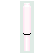

# SPEEDY FOX

## GAME DESIGN DOCUMENT

Creado por: Isaac Fontal Corredoira

Versión del documento: 1.03

## HISTORIAL DE REVISIONES

| Versión | Fecha | Comentarios |
| --- | --- | --- |
| 1.00 | 16/03/24 | Creación del documento |
| 1.01 | 26/03/24 | Revisión del documento |
| 1.02 | 30/03/24 | Revisión del documento |
| 1.03 | 06/04/24 | Revisión del documento |

## RESUMEN

### Concepto

>Juego de plataformas inspirado en el mítico Sonic de Master System II.

### Puntos Clave

>- Gráficos retro 2D
>- Variedad de enemigos
>- Trampas y objetos ocultos
>- Límite de tiempo
>- Coleccionables

### Género

>Plataformas 2D

### Público Objetivo

>Personas de cualquier género, de 7 años en adelante.

### Experiencia de Juego

>Fox debe recorrer el mundo recogiendo gemas, evitando a distintos tipo de criaturas y sorteando trampas de pinchos, para llegar al final en el menor tiempo posible.

## DISEÑO

### Metas de Diseño

>- Nostalgia: el juego busca recordar los míticos juegos de plataformas de los años 90, usando gráficos sencillos pero vistosos que emulen el ambiente de los videojuegos de la época.
>- Facilidad: el videojuego utiliza mecánicas sencillas para que sea jugable por todos los públicos. Las plataformas y los resortes son intuitivos y fáciles de utilizar.

## MECÁNICAS DE JUEGO

### Núcleo de Juego

>El desarrollo del juego consiste en ir avanzando por el nivel hasta llegar al final en el menor tiempo posible.
>
>Existe un límite de tiempo de 5 minutos para completar cada nivel. Si el reloj llega a 5 minutos, el jugador pierde una vida instantaneamente.
>
>El jugador comienza la partida con 3 vidas.
>
>A lo largo de cada nivel existen objetos que podemos recolectar. El objeto principal son las gemas, que proporcionan salud al jugador. Mientras el jugador posea gemas, no puede perder una vida al ser atacado o caer en una trampa. En el momento que el jugador es atacado o cae en una trampa, pierde todas las gemas, volviéndose invulnerable durante 3 segundos (un pequeño porcentaje de las gemas que poseía pueden ser recuperadas durante un breve lapso de tiempo). Si el jugador es atacado o cae en una trampa en el momento que su contador de gemas sea 0, el jugador pierde una vida.
>
>Si el jugador recolecta 100 gemas obtiene una vida extra, aunque en ese momento su contador de gemas vuelve a 0.
>
>Cuando el jugador pierde todas sus vidas, el juego termina, aunque existe la posibilidad de continuar el juego si el jugador había recolectado algún papiro. Si el juego continúa, la puntuación total se reinicia en ese momento y el jugador vuelve a empezar con el número de vidas original.
>
>Cuando el jugador llega al final del nivel y toca la señal final, ésta gira hasta mostrar un resultado aleatoriamente. Se pueden obtener 10 gemas extras, una vida extra o que no ocurra absolutamente nada. En ese momento el nivel finaliza y se calcula la puntuación obtenida.
>
>Si el jugador finaliza el último nivel, gana la partida y se muestra la puntuación total.

### Flujo de Juego

>

### Fin de Juego

>El juego puede terminar por las suguientes situaciones:
>- Derrota: Fox pierde todas sus vidas y papiros.
>- Victoria: Fox derrota a Minocow.

### Física de Juego

>El juego usa el motor de físicas de Unity para todos los movimientos del personaje principal. Los enemigos se mueven mediante rutinas de movimento.

### Controles

> | Tecla | Accion |
> | --- | --- |
> | Flecha Izq / Der | Izq / Der |
> | Espacio | Saltar |
> | Flecha abajo | Agacharse / Mirar abajo |
> | Control Izq | Atacar |
> | P | Pausa |
> | Esc | Salir |

## MUNDO DEL JUEGO

### Descripción General

>El juego se desarrolla en un entorno natural, bosque, cuevas, agua...

### Personajes

> - Jugables:
>
> | Nombre | Imagen | Descripción |
> | --- | --- | --- |
> | Fox |  | Nuestro protagonista. Puede saltar, agacharse y atacar a sus enemigos con su ataque giratorio. |
> - Enemigos:
>
> | Nombre | Imagen | Descripción |
> | --- | --- | --- |
> | Bat |   | Bat espera colgado hasta que nos acerquemos lo suficiente para pasar al ataque. |
> | Bicho |  | Bicho aparece volando en dirección al jugador.
> | Dino |  | Dino corre de un lado a otro controlando una zona.
> | Águila |   | Águila aparece volando en dirección al jugador y en el momento menos esperado lanza su ataque en picado.
> | Slimer |  | Slimer se activa cuando el jugador se acerca lo suficiente.
> | Buitre |   | Buitre alza el vuelo cuando el jugador se acerca, controlando una zona vertical.
> | Minocow |  | Minocow es el jefe final. Sus ataques son irrefrenables y solo puede ser herido cuando se cansa.

### Objetos

> | Nombre | Imagen | Descripción |
> | --- | --- | --- |
> | Gema |  | Las gemas son la fuerza de Fox. Mientras posea gemas, no puede morir. Por cada 100 gemas, Fox obtiene una vida. |
> | Gema Roja |  | La gema roja proporciona 10 gemas instantaneamente.
> | Cerezas |  | Las cerezas proporcionan una vida a Fox.
> | Papiro |  | El papiro le proporciona a Fox una nueva oportunidad en el caso de que pierda todas sus vidas.
> | Señal final |  | Esta señal se encuentra al final de cada nivel (excepto en los que aparezca Minocow). Al tocarla Fox, girará y mostrará un resultado que puede proporcionar alguna bonificación:
> | |  | Gema roja: proporciona 10 gemas más.
> | |  | Fox: proporciona una vida extra.
> | |  | Cruz: no ocurre nada.

### Flujo de Pantallas

>- Pantalla inicial:  Es la pantalla de inicio de juego donde se muestra una demo de Fox corriendo. Cuando el jugador pulse Intro comienza el juego.
>
>- Pantalla de juego:  La pantalla principal de juego.
>
>- Pantalla de GameOver/Continue:  Si el personaje pierde todas sus vidas, esta pantalla nos permite continuar el juego (en el caso de poseer algún papiro) o terminar el juego inmediatamente.
>
>- Pantalla de fin de nivel:  Al terminar un nivel, esta pantalla muestra la puntuación conseguida en el nivel y la total.
>
>- Pantalla final:  Si el jugador consigue la victoria, esta pantalla muestra la puntuación final.

### HUD

>
>1. Contador de gemas
>2. Tiempo transcurrido
>3. Vidas restantes

## ARTE

### Metas de Arte

>El arte del videojuego intenta recrear el ambiente de los míticos videojuegos plataformas de los años 90. Son gráficos sencillos en 2D que nos recuerdan a aquellos gráficos de 8 bits.

### Assets de Arte

>#### Fox:
>
>
>
>
>
>
>
>#### Enemigos:
>
>
>
>
>
>
>
>
>
>
>
>
>
>
>
>
>
>
>
>
>
>
>
>
>
>
>
>
>
>
>
>
>
>
>
>
>
>
>
>
>
>
>
>
>
>
>
>
>
>
>
>
>#### Minocow:
>
>
>#### Objetos:
>
>
>
>
>
>
>
>
>
>
>
>
>
>
>
>
>
>
>
>
>
>
>
>
>
>
>
>
>
>
>
>
>

## AUDIO

### Metas de Audio

> La música es un elemento importante de ambientación del juego. Es una música dinámica que pretende darle sensación de velocidad a la partida. Los efectos de sonido buscan darle sonoridad a todas las acciones del jugador, con sonidos que evocan a los míticos juegos de los años 90.

### Assets de Audio

>#### Música:
>- [Música princial](../Assets/Sound/Music/under%20the%20rainbow.ogg)
>- [Música pantalla de inicio](../Assets/Sound/Music/Maniac.ogg)
>- [Música batalla final](../Assets/Sound/Music/boss-music.wav)
>- [Música pantalla final](../Assets/Sound/Music/Hurt_and_heart.ogg)
>#### Sonidos:
>- Fox:
>   - [Sonido de salto](../Assets/Sound/Fx/jump.wav)
>   - [Sonido de ataque](../Assets/Sound/Fx/attack.mp3)
>   - [Sonido de daño](../Assets/Sound/Fx/hurt.mp3)
>   - [Sonido de muerte](../Assets/Sound/Fx/death.mp3)
>- Enemigos:
>   - [Sonido de muerte](../Assets/Sound/Fx/enemy-death.wav)
>- Minocow:
>   - [Sonido de ataque 1](../Assets/Sound/Fx/pound-attack.mp3)
>   - [Sonido de ataque 2](../Assets/Sound/Fx/stomp-attack.wav)
>   - [Sonido de ataque 3](../Assets/Sound/Fx/swing-attack.mp3)
>   - [Sonido de bufido](../Assets/Sound/Fx/snort.wav)
>   - [Sonido de muerte](../Assets/Sound/Fx/boss-death-sound.mp3)
>- Objetos:
>   - [Sonido de gemas](../Assets/Sound/Fx/gem-sound.wav)
>   - [Sonido de cerezas](../Assets/Sound/Fx/live-up.mp3)
>   - [Sonido de papiros](../Assets/Sound/Fx/continue-sound.mp3)
>   - [Sonido de resorte](../Assets/Sound/Fx/jump-pad.mp3)
>   - [Sonido de señal de fin de nivel](../Assets/Sound/Fx/goalsign.mp3)
>
>- [Sonido de fin de nivel](../Assets/Sound/Fx/goal-sound.mp3)
>- [Sonido de cálculo de puntuación](../Assets/Sound/Fx/score-calc.mp3)
>- [Sonido de entrada a agua](../Assets/Sound/Fx/water-in.mp3)
>- [Sonido de salida de agua](../Assets/Sound/Fx/water-out.mp3)

## DETALLES TÉCNICOS

### Plataformas Objetivo

> PC / Windows
>
> Requisitos Mínimos:
> - SO: Windows 7
> - Procesador: 1.80GHz
> - Memoria RAM: 4 GB
> - Gráficos: Intel HD Graphics 4000-5000 series

### Herramientas de Desarrollo

> El juego se ha desarrollado íntegramente mediante Unity
